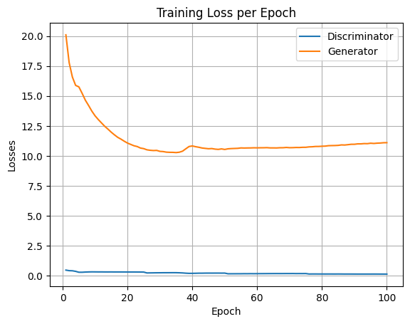
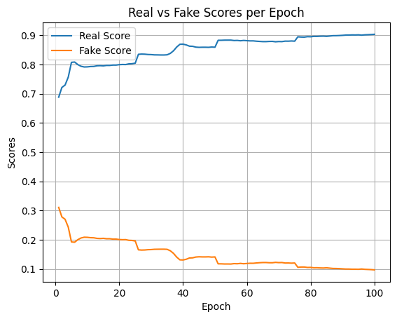

# Sketch2Shoe: Generating Photorealistic Footwear from Edge Maps

This project implements a **Pix2Pix Conditional GAN** that translates **edge-map sketches of shoes** into **photorealistic footwear images**.  
It leverages the [edges2shoes dataset](http://efrosgans.eecs.berkeley.edu/pix2pix/datasets/) and demonstrates training, evaluation, and deployment using **PyTorch** and **Gradio**.

---

## Features
- **Pix2Pix Generator & Discriminator** with skip connections (U-Net style).
- **Training pipeline** for adversarial + L1 loss.
- **Visualization tools**: save generated samples at intervals, plot losses & scores.
- **Evaluation mode**: generate shoe images from unseen sketches.
- **Interactive UI**: deploy the generator using [Gradio](https://gradio.app/).

---

## Repository Structure
```
Sketch2Shoe-Generating-Photorealistic-Footwear-from-Edge-Maps/
│── Sketch2Shoe.ipynb       # Main notebook (training + evaluation + UI)
```

--- 

## Installation

Clone the repository and install dependencies:

```bash
git clone https://github.com/Aman-Sunesh/Sketch2Shoe-Generating-Photorealistic-Footwear-from-Edge-Maps.git
cd Sketch2Shoe-Generating-Photorealistic-Footwear-from-Edge-Maps
pip install -r requirements.txt
```

---

## Training

Download the **edges2shoes dataset**:

```python
dataset_name = "edges2shoes"
_URL = f"http://efrosgans.eecs.berkeley.edu/pix2pix/datasets/{dataset_name}.tar.gz"
```

Run the training loop in the notebook:

```python
history = fit(
    discriminator=discriminator,
    generator=generator,
    train_dl=train_dl,
    fixed_sketches=fixed_sketches,
    denorm=denorm,
    epochs=100,
    lr=2e-4,
    lambda_L1=100
)
```

Generated samples will be saved in the `generated/` folder.

---


## Metrics
- **Generator Loss** vs. Epoch  
- **Discriminator Loss** vs. Epoch  
- **Real vs Fake Scores**  

(See training plots below)

  
  

---

## Inference

After training, load the generator and translate sketches:

```python
generator = Pix2PixGenerator()
generator.load_state_dict(torch.load('G.pth'))
generator.eval()
```

Run on validation images or upload your own sketch.  

---

## Interactive Demo

Launch a Gradio demo locally:

```python
iface = gr.Interface(
    fn=translate,
    inputs=gr.Image(type="pil", label="Input Sketch"),
    outputs=gr.Image(type="pil", label="Generated Shoe"),
    title="Sketch2Shoe",
    description="Upload a shoe sketch; get a photorealistic footwear image."
)
iface.launch()
```

---

##  Requirements

Dependencies are listed in `requirements.txt`:

- `torch`, `torchvision`
- `numpy`, `pillow`, `matplotlib`
- `tqdm`, `gradio`
- `jupyter`, `ipywidgets` (for notebooks)

---

## License
This project is open-sourced under the MIT License.

---

## Acknowledgements
- [Pix2Pix paper](https://arxiv.org/abs/1611.07004) by Isola et al.
- [edges2shoes dataset](http://efrosgans.eecs.berkeley.edu/pix2pix/datasets/)

---
